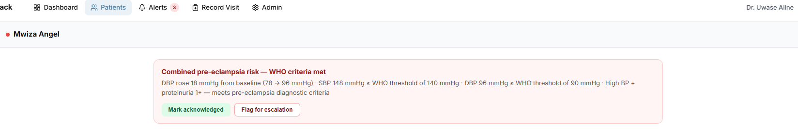
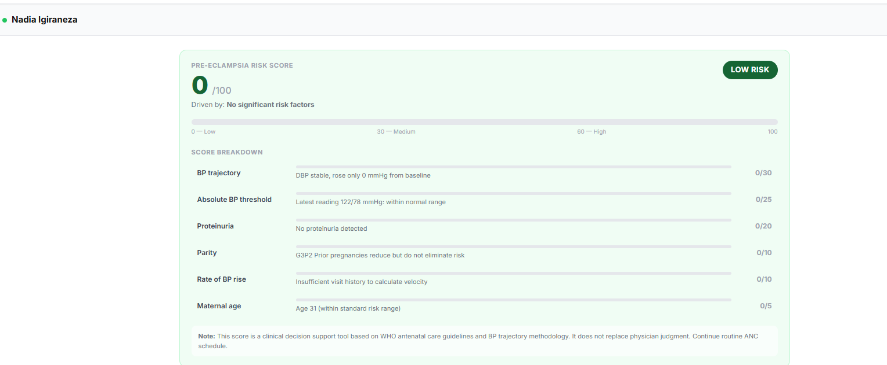
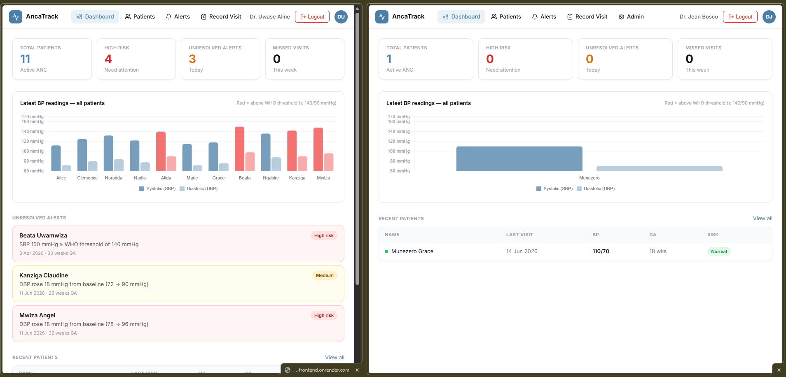

# AncaTrack: Antenatal Care Clinical Decision Support Platform

AncaTrack is a web-based clinical decision support tool designed for doctors in Rwandan district hospitals. It aggregates blood pressure, proteinuria, and gestational age data collected during routine antenatal care (ANC) visits, detects dangerous BP trajectories using WHO threshold rules, and generates automated pre-eclampsia risk alerts on a doctor-facing dashboard. The system also computes a weighted 0–100 risk score per patient based on six clinical factors, and supports bulk visit import via Excel/CSV upload.

---

## Live Deployment

**Frontend (main app):** https://ancatrack-frontend.onrender.com

**Backend API:** https://ancatrack-backend.onrender.com/api/health


---

## Demo Login Credentials

| Role   | Email                        | Password     |
|--------|------------------------------|--------------|
| Doctor | a.uwase@bugesera.rw          | password123  |
| Nurse  | j.mutesi@bugesera.rw         | password123  |
| Admin  | admin@bugesera.rw            | password123  |

## Demo patient login credentials

| Role   | Name                  | PIN   |
|--------|-----------------------|-------|
|Patient | Mwiza Angel           | 1234  |

---

## Demo Video

[Watch the 5-minute demo on drive](https://drive.google.com/drive/folders/1l7zGBtEahQZqtBwJItAF9yNGh1DpsuM3?usp=sharing)


---

## Tech Stack

| Layer      | Technology                                          |
|------------|-----------------------------------------------------|
| Frontend   | React, TypeScript, Vite, Chart.js                   |
| Backend    | Node.js, Express, TypeScript                        |
| Database   | MongoDB (Atlas cloud), Mongoose                     |
| Auth       | JWT + bcrypt                                        |
| Deployment | Render (backend Web Service + frontend Static Site) |
| SMS	       | Africa's Talking                                    |


---

## Local Installation and Setup

### Prerequisites

- Node.js
- MongoDB running locally (for local dev), or use the Atlas URI directly
- Git

---

### Step 1: Clone the repository

```bash
git clone https://github.com/aineza1/ancatrack.git
cd ancatrack
```

---

### Step 2: Set up the backend

```bash
cd backend
npm install
```

Seed the database with demo users and patients:

```bash
npm run seed
```

Start the backend dev server:

```bash
npm run dev
```

The API will be available at `http://localhost:5000`. Verify with: http://localhost:5000/api/health
Expected: `{"status":"ok","env":"development"}`

---

### Step 3 — Set up the frontend

Open a second terminal:

```bash
cd frontend
npm install
```

Create a `.env` file in the `frontend` folder:
VITE_API_URL=http://localhost:5000/api

Start the frontend dev server:

```bash
npm run dev
```

The app will be available at `http://localhost:5173`.

---

### Step 4: Log in

Open `http://localhost:5173` in your browser and log in with one of the roles provide

---

## Core Features

## Doctor-Facing Dashboard

- **Live stats:** total patients, high-risk count, unresolved alerts
- **BP overview chart:** displays all assigned patients with WHO threshold markers
- **Active alerts section:** shows unresolved alerts with acknowledge/escalate actions
- **Recent patients table:** quick access to patient records


## Patient Management

- **Patient list:** view all assigned patients with risk indicators
- **Patient detail view:** full visit history, BP trend chart (line/bar toggle) with WHO danger-zone lines
- **Alert banners:** display active alerts with acknowledge and escalate actions
- **Risk score card:** weighted 0–100 score with visual breakdown and band classification (Low/Medium/High)
- **Visit recording:** add new visits with live alert preview before saving


## Pre-eclampsia Risk Score

Computes a weighted 0–100 score across six clinical factors:

| Factor | Weight |
|--------|--------|
| BP Trajectory (diastolic rise from baseline) | 30 pts |
| Absolute BP Threshold (≥140/90) | 25 pts |
| Proteinuria | 20 pts |
| Parity | 10 pts |
| Velocity of BP Rise | 10 pts |
| Maternal Age | 5 pts |

Score is displayed with a visual breakdown and band classification (Low / Medium / High).


## BP Trajectory Alerting

Automatically detects dangerous blood pressure rises across ANC visits using WHO threshold rules:

- Diastolic rise ≥15 mmHg from baseline
- Systolic ≥140 mmHg
- Diastolic ≥90 mmHg
- Combined risk: high BP + proteinuria ≥1+

Alerts are stored in MongoDB and shown on the doctor dashboard and individual patient pages.


## CSV/Excel Bulk Import

Nurses can upload a `.xlsx` or `.csv` file of multiple patient visits at once:

- Matches existing patients by name and date of birth
- Creates new patient records for unrecognized entries
- Validates each row
- Runs the alert engine automatically after import
- Returns a row-by-row result summary


## Role-Based Access Control

| Role | Permissions |
|------|-------------|
| **Doctor** | View assigned patients, record visits, acknowledge/escalate alerts, view patient details |
| **Nurse** | Register patients, record visits, bulk import |
| **Admin** | Manage user accounts, all doctor/nurse permissions |

JWT authentication protects all API endpoints. Patient filtering is enforced at the API level — doctors see only their assigned patients.


## Admin Panel

- Create new users
- Assign roles (doctor/nurse/admin)
- Activate or deactivate accounts
- View all users


## Patient Portal

Patients can log in using their phone number and a PIN set during registration:

- View their own BP readings in plain language
- See visit history
- Check next scheduled visit date
- View risk status (Normal/Monitor/High)
- Simple status indicator showing whether readings are within normal range or need attention

**Language support:** Toggle between English and Kinyarwanda for all patient-facing content.


## SMS Notifications

When a high-risk alert fires after a visit is recorded:

- **Patient receives an SMS:** "Your blood pressure reading needs attention. Please contact your clinic."
- **Doctor receives an SMS:** Clinical summary with patient name, threshold breached, and recommendation to review.

Works on any MTN or Airtel Rwanda phone — no internet or smartphone needed.


## USSD Interface

For patients with basic phones and no data plan:

- Dial a short code from any phone
- Menu options: check last BP reading, check next visit date, contact doctor
- Works with zero data and zero internet
- PIN-authenticated session for security

**Status:** Fully built and tested in Africa's Talking sandbox. Live shortcode registration is the final deployment step.

**Responsive design:** TopNav collapses to a hamburger menu on mobile; patient detail and risk score card adapt to narrow screens.

---

## API Endpoints

| Method | Endpoint | Access | Description |
|--------|----------|--------|-------------|
| POST | `/api/auth/login` | Public | Login, returns JWT |
| GET | `/api/auth/me` | Authenticated | Current user |
| GET | `/api/patients` | Authenticated | List patients (filtered by doctor) |
| GET | `/api/patients/:id` | Authenticated | Patient detail + active alerts |
| POST | `/api/patients` | Nurse/Admin | Register new patient |
| POST | `/api/patients/:id/visits` | Nurse/Admin | Record a visit |
| GET | `/api/alerts` | Authenticated | Active alerts |
| PATCH | `/api/alerts/:id/acknowledge` | Doctor/Admin | Acknowledge alert |
| PATCH | `/api/alerts/:id/escalate` | Doctor/Admin | Escalate to specialist |
| POST | `/api/import` | Nurse/Admin | Bulk import visits from Excel/CSV |
| GET | `/api/users` | Admin | List all users |
| POST | `/api/users` | Admin | Create new user |
| PATCH | `/api/users/:id/toggle` | Admin | Activate/deactivate user |
| GET | `/api/health` | Public | Health check |

---

## Deployment

The application is deployed on Render using a monorepo structure:

**Backend:** Render Web Service
- Root Directory: `backend`
- Build: `npm install && npm run build`
- Start: `npm start`
- Environment: MongoDB Atlas, JWT secret, `NODE_ENV=production`

**Frontend:** Render Static Site
- Root Directory: `frontend`
- Build: `npm install && npm run build`
- Publish: `dist`
- Environment: `VITE_API_URL` pointing to the backend service URL

Database is hosted on MongoDB Atlas with network access open to all IPs
---

## Testing

The following tests were conducted on the live deployed version at
https://ancatrack-frontend.onrender.com

---

### 1. Authentication and Security

**Valid login accepted**
- Action: Logged in as `a.uwase@bugesera.rw / password123`
- 
-  JWT authentication works end to end

---

### 2. Alert Engine: Core Algorithm with Different Data Values

**High risk: combined pre-eclampsia criteria correctly detected**
- Action: Opened Mwiza Angel's patient detail page
- 
- **What it shows:** Alert engine correctly identifies 18mmHg DBP rise from
  baseline combined with 1+ proteinuria as meeting WHO pre-eclampsia
  diagnostic criteria — the two conditions together trigger COMBINED_RISK
  severity, not just medium

**Low risk: no false positive for stable readings**
- No alert banner, LOW risk score, green status indicator
- 
- What it shows: Alert engine correctly produces no alert for a patient
  within normal ranges, system avoids false positives which would reduce
  clinical trust

---

### 3. Role-Based Access Control

**Doctors see only their own assigned patients**
- Action: Logged in as Dr. Uwase (Tab 1) and Dr. Jean Bosco (Tab 2) simultaneously
- Expected: Each doctor sees a different patient list
- 
- What it shows: Patient filtering is enforced at the API level —
  `GET /api/patients` applies an `assignedDoctor` filter server-side,
  not just on the frontend

**Doctor role blocked from Admin page**
- Action: Logged in as Dr. Uwase, navigated to `/admin`
- 
- What it shows: 'You do not have permission for this action.' access denied


---

### 4. Performance Across Hardware and Software Environments

**Chrome on Windows (desktop)**

- Expected: Full functionality, all pages load correctly
- 
- What it shows: Primary browser compatibility

**Mobile responsive layout**
- menu in TopNav, single-column stacked layout on patient detail
- 
- What it shows: Responsive design adapts correctly to narrow
  viewports; useIsMobile hook triggers layout changes at 768px
  breakpoint, tested at 12 Pro width

---

## Discussion


The risk score is the feature that most directly answers the
ask for something beyond basic data capture. It combines six clinical
factors into a transparent, explainable score that a doctor can walk a
patient through, which matters for adoption, since clinicians don't act
on scores they can't explain.

The patient portal and USSD interface extend the platform's reach beyond the clinic. Patients with smartphones can check their readings online; patients with basic phones can access the same information via USSD. This dual-channel approach addresses the full spectrum of patient accessibility in Rwanda.

One limitation: the hosting tier introduces a cold-start
delay of up to a few seconds after inactivity, which is not acceptable in
a live clinic. Before real deployment, this would need to
be resolved through a better hosting plan or local server installation
at the facility.

## Recommendations and Future Work

### Short-Term (Next Phase)

- **Pregnancy outcome recording:** track delivery, stillbirth, maternal complications, or referrals to higher facilities
- **Automated follow-up reminders:** when a high-risk patient misses a visit, system automatically sends SMS nudge and notifies doctor
- **Kinyarwanda language support for main portal:** extend language toggle beyond patient portal to include doctor dashboard and all clinical interfaces

### Medium-Term

- **Mobile app:** dedicated patient-facing mobile application
- **Follow-up for missed visits:** automated SMS reminders for patients who miss scheduled appointments, with escalation to community health workers after multiple missed visits

### Long-Term

- **IoT integration:** direct data capture from BP devices

## License
This project is developed for academic purposes as part of the BSc Software Engineering capstone at African Leadership University.

